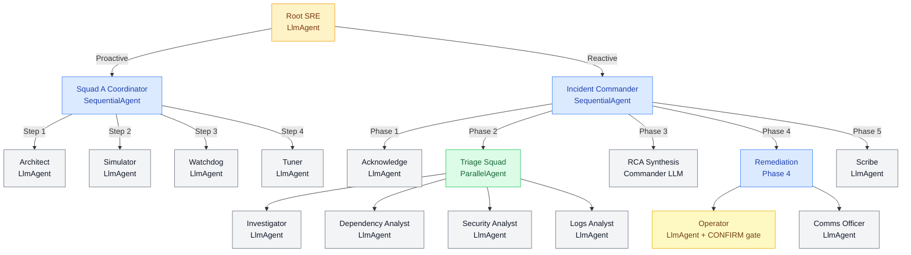

# 🤖 SRE Multi-Agent Platform — Powered by Google ADK

> **Production-grade Site Reliability Engineering (SRE) using a multi-agent AI architecture.**
> Engineered with Google Agent Development Kit (ADK), deployed on GCP, with full observability via Cloud Trace, Langfuse, LangSmith, Prometheus, and Grafana.

---

## 🎯 Executive Summary

Modern SRE is traditionally reactive — humans get paged, scramble to find dashboards, and manually triage alerts. This platform demonstrates a paradigm shift: **AI agents performing the heavy lifting of infrastructure management and incident response.**

- **15 distinct AI agents** across 2 specialized squads — Squad A (Proactive Platform Engineers) and Squad B (Reactive SRE Responders), orchestrated by a central routing agent
- **Service Onboarding (Day 0/1):** Auto-generates architecture blueprints, SLO recommendations, and monitoring configurations
- **Platform Health (Day 2+):** Proactively monitors infrastructure, API quotas, and metric ingestion pipelines
- **P1 Incident Response:** Executes a 5-phase sequential pipeline activating 9 agents — from parallel triage to remediation, communications, and automated postmortem generation
- **Enterprise Observability:** Every agent action is traced, logged, and scored — full span hierarchies (tool latency, token counts, agent delegation chains) visible in Cloud Trace and Langfuse

---

## 📋 Table of Contents

1. [Architecture Overview](#architecture-overview)
2. [Agent Design — Squad A & Squad B](#agent-design)
3. [Infrastructure Stack](#infrastructure-stack)
4. [Observability Stack](#observability-stack)
5. [Agent Evaluation Framework](#agent-evaluation-framework)
6. [Observability Tool Comparison](#observability-tool-comparison)
7. [Deployment Architecture](#deployment-architecture)
8. [Conceptual Repository Structure](#conceptual-repository-structure)
9. [Roadmap](#roadmap)

---

## 🏛️ Architecture Overview

### End-to-End System Data Flow

```
┌──────────────────────────────────────────────────────────────────────────────────┐
 │                          GCP INFRASTRUCTURE LAYER                                │
 │                                                                                  │
 │  Target Services                 Observability Backend                           │
 │  ┌───────────────────┐           ┌────────────────────────────────┐              │
 │  │ App Containers    │──scrape──>│ Prometheus                     │              │
 │  │ /metrics endpoint │           │ Grafana                        │              │
 │  └───────────────────┘           │ Alertmanager                   │              │
 │                                  └──────────────┬─────────────────┘              │
 │                                                 │ alert fired (SLO breach)       │
 │  Serverless Tooling                             v                                │
 │  ┌────────────────────────┐      ┌──────────────────────────┐                    │
 │  │ Cloud Functions        │      │ Pub/Sub Event Bus        │                    │
 │  │ (Prometheus, Logs, etc)│      └──────────────┬───────────┘                    │
 │  └──────────┬─────────────┘                     │                                │
 │             │ HTTP calls from agents            │ triggers                       │
 │             v                                   v                                │
 │  ┌────────────────────────────────────────────────────────────────────────┐      │
 │  │                    AGENT ORCHESTRATION LAYER                           │      │
 │  │                                                                        │      │
 │  │         ┌────────────────────────────────────┐                         │      │
 │  │         │      SRE Platform Agent (root)     │                         │      │
 │  │         │   Classifies intent -> routes to   │                         │      │
 │  │         │   Squad A (proactive) or           │                         │      │
 │  │         │   Squad B (reactive/incident)      │                         │      │
 │  │         └──────────────┬─────────────────────┘                         │      │
 │  │                        │                                               │      │
 │  │          ┌─────────────┴───────────────┐                               │      │
 │  │          v                             v                               │      │
 │  │  ┌────────────────────┐  ┌──────────────────────────────────┐          │      │
 │  │  │      SQUAD A       │  │            SQUAD B               │          │      │
 │  │  │  (SequentialAgent) │  │   (SequentialAgent pipeline)     │          │      │
 │  │  │                    │  │                                  │          │      │
 │  │  │ > Architect        │  │ Phase 1: Acknowledge             │          │      │
 │  │  │ > Simulator        │  │ Phase 2: Triage <- ParallelAgent │          │      │
 │  │  │ > Watchdog         │  │   ├── Investigator               │          │      │
 │  │  │ > Tuner            │  │   ├── Dependency Analyst         │          │      │
 │  │  └────────────────────┘  │   ├── Security Analyst           │          │      │
 │  │                          │   └── Logs Analyst               │          │      │
 │  │                          │ Phase 3: RCA (synthesis)         │          │      │
 │  │                          │ Phase 4: Operator (CONFIRM) +    │          │      │
 │  │                          │          Comms Officer           │          │      │
 │  │                          │ Phase 5: Scribe -> Postmortem    │          │      │
 │  │                          └──────────────────────────────────┘          │      │
 │  └────────────────────────────────────────────────────────────────────────┘      │
 │                                                                                  │
 │  OBSERVABILITY LAYER (Cross-cutting - all layers active simultaneously)          │
 │  ┌──────────────────────────────────────────────────────────────────────────┐    │
 │  │ ADK Web UI     -> Real-time trace tree, session state, YAML event stream │    │
 │  │ OTel Spans     -> Cloud Trace & Langfuse (execution trees, token counts) │    │
 │  │ Structured Logs-> Cloud Logging (JSON, duration_ms, status per tool)     │    │
 │  │ Custom Metrics -> Cloud Monitoring (duration, call counts, error rates)  │    │
 │  └──────────────────────────────────────────────────────────────────────────┘    │
 └──────────────────────────────────────────────────────────────────────────────────┘
```

---

### Agent State Machine & Execution Flow



---

### Key Architectural Decisions

| Decision | Rationale |
|---|---|
| **Sequential Pipelines** | Guarantees phase ordering in incident response — triage must complete before remediation begins |
| **Parallel Triage** | Investigator, Security, Dependency, and Logs agents run simultaneously, drastically reducing MTTR |
| **Session State Handoffs** | Agents share data via decoupled `session.state` rather than direct API calls — high fault tolerance |
| **CONFIRM Safety Gate** | Hard lock on the Operator agent — no infrastructure mutation without explicit human approval |
| **Asynchronous Telemetry** | Metric exporters run in background queues to prevent observability overhead from delaying agent response |
| **OTLP for Langfuse** | Reuses ADK's existing OpenTelemetry provider — zero additional instrumentation on the agent code |

---

## 🤖 Agent Design

### Squad A — Proactive Platform Engineers

Handles proactive optimization, new service onboarding, alert tuning, and system health checks.

- **Architecture Agent** — Detects tech stacks from repositories, generates SLO YAML configs, and drafts monitoring infrastructure as code (Terraform)
- **Simulator Agent** — Backtests new alert configurations against historical telemetry to prevent alert fatigue before rules go live
- **Data Health Watchdog** — Monitors the monitoring system itself: validates metric ingestion rates, checks API quotas, and pings agent infrastructure health
- **Tuner Agent** — Analyzes historical alert noise and metric distributions to dynamically recommend P95/P99 threshold adjustments

---

### Squad B — Reactive SRE Responders

Handles reactive P1/P2 incident response via a strict 5-phase `SequentialAgent` pipeline.

**Phase 1 — Acknowledge**
- Triggers PagerDuty on-call escalation and spins up a dedicated Slack incident channel

**Phase 2 — Triage** *(4 agents run in parallel)*
- **Investigator** — Executes PromQL queries and calculates composite service health scores
- **Dependency Analyst** — Checks external API health and upstream cloud provider status
- **Security Analyst** — Audits Cloud Armor/WAF rules for active attack patterns
- **Logs Analyst** — Fetches recent error logs and correlates them with distributed trace IDs

**Phase 3 — Root Cause Analysis**
- The Commander LLM synthesizes all parallel triage output into a root cause hypothesis

**Phase 4 — Remediation**
- **Operator** — Executes infrastructure fixes (e.g., Kubernetes rollback, WAF rule update) — requires explicit human `CONFIRM`
- **Comms Officer** — Updates public status pages and broadcasts internal Slack notifications

**Phase 5 — Postmortem**
- **Scribe** — Auto-drafts a structured incident timeline and creates follow-up Jira tickets

---

### ⚠️ The CONFIRM Safety Gate

The Operator agent features a hard safety lock. For any mutable infrastructure action (Kubernetes resource changes, WAF rule updates), the system prompt enforces:

1. **Propose** the exact action to be taken with full context
2. **Halt** execution and wait for explicit human `CONFIRM` input in the next message
3. **Execute** only upon receiving the `CONFIRM` keyword — never autonomously

This is the most critical production safety pattern in the system. Agents are first responders; humans remain decision-makers.

---

## ☁️ Infrastructure Stack

The platform is designed to interface with modern cloud-native environments:

| Component | Technology | Role |
|---|---|---|
| **Compute & Workloads** | Cloud Run, GKE, Compute Engine | Host target services and agent runtime |
| **Telemetry Generation** | Prometheus + Cloud Logging | Scrapes `/metrics` endpoints, collects native logs |
| **Event Routing** | Alertmanager → Pub/Sub | Routes SLO breach alerts to trigger agent workflows |
| **Agent Tools** | Cloud Run Functions | Serverless HTTP functions called by agents (PromQL, Logs, Health) |
| **Secrets** | Secret Manager | API keys, tokens — never hardcoded |
| **CI/CD** | Cloud Build | Auto-deploys agent updates on code push |

---

## 👁️ Observability Stack (7-Layer)

This platform implements one of the most comprehensive observability patterns available for multi-agent systems. Every action is logged, traced, and scored.

| Layer | Tool | What It Captures |
|---|---|---|
| 1 | **ADK Web UI** | Real-time trace tree, full prompt/response, session state — best for development |
| 2 | **Structured Logs** | JSON logs per tool call: `duration_ms`, `status`, `agent`, `call_id` |
| 3 | **Cloud Trace** | GCP distributed tracing — deep agent hierarchy + GenAI token counts |
| 4 | **Agent Evaluation** | Automated scoring against 10 golden scenarios (tool accuracy + keyword coverage) |
| 5 | **LangSmith** | Tool-level tracing — useful for LangChain/LangGraph team comparisons |
| 6 | **Langfuse** | OTLP export — cost dashboards, P95 latency, usage capacity planning |
| 7 | **Cloud Monitoring** | Async custom metrics: `tool_calls_total`, `tool_duration_ms` for Grafana |

### Example Telemetry Profile

When an agent performs a full system check, the resulting OpenTelemetry span waterfall captures every sub-action:

```
Span Waterfall (example run):
  invocation                                     ████████████████████ ~50s
    invoke_agent sre_platform [GenAI]            ████████████████████
      call_llm                                   ████████████████████
        generate_content [gemini-2.5-flash]      ████████████
        invoke_agent squad_a_coordinator         ████████████
          invoke_agent watchdog                  ████████
            watchdog.query_internal_metrics      ███  ~7s    ← custom span
            watchdog.alert_platform_team         █    ~1s    ← custom span
            watchdog.check_gcp_quotas            ██   ~11s   ← custom span
            watchdog.ping_agent_runtime          █    ~2ms   ← custom span
```

All spans appear simultaneously in Cloud Trace and Langfuse via a single OTLP export. The ADK Web UI shows them in real-time during execution.

---

## 🧪 Agent Evaluation Framework

Testing LLMs requires a shift from unit tests to **probabilistic evaluation**. This platform includes an automated scoring pipeline.

### Scoring Formula

```
Tool Accuracy   = (expected tools called) / (total expected tools)
Keyword Coverage = (expected keywords in response) / (total expected keywords)
Overall Score   = (Tool Accuracy + Keyword Coverage) / 2
PASS            = Overall Score ≥ 0.70  (production gate: ≥ 0.90)
```

### What Gets Tested

- **Tool Accuracy** — Did the agent select the optimal tool set for the scenario?
- **Keyword Coverage** — Did the final synthesis contain the required technical context?
- **Pass/Fail Gates** — CI/CD pipelines require ≥90% overall score across 10 golden scenarios (e.g., `latency_incident`, `security_incident`, `resource_saturation`) before any prompt update is deployed

---

## 📊 Observability Tool Comparison

For enterprise implementations, the observability stack is tailored to the client's ecosystem:

| Client Profile | Recommended Stack |
|---|---|
| **Enterprise / GCP-Native** | Cloud Trace + Cloud Monitoring + Native Logs |
| **Multi-Cloud / Framework-Agnostic** | Langfuse (self-hosted or cloud) + custom metrics |
| **LangChain / LangGraph Teams** | LangSmith native integration |
| **Strict Compliance / Data Sovereignty** | Langfuse self-hosted within client VPC |
| **Small Company / Budget-Conscious** | Langfuse cloud free tier + ADK Web UI |

---

## 🚀 Deployment Architecture

### Development (Current)
Agents run locally via `adk web`, connecting to GCP services (Cloud Trace, Langfuse) over the internet.

### Production Target (Cloud Run)
```
Cloud Run (containerized ADK agent)
  ├── stdout logs     → Cloud Logging (automatic)
  ├── Cloud Logging   → Cloud Monitoring log-based metrics
  ├── OTel spans      → Cloud Trace (native, low latency)
  └── OTel spans      → Langfuse (same OTLP code, zero changes)
```

Deploying to Cloud Run requires **zero code changes** — the observability stack auto-upgrades to native Cloud Logging ingestion.

---

## 📂 Conceptual Repository Structure

> *Note: This represents the architectural structure of the implementation. Specific file names and internal logic are proprietary.*

```
Multi-Agent-SRE-Platform/
├── core_engine/
│   ├── agent_router/            ← Root intent classification & routing
│   ├── observability/           ← OTel setup, @observe decorator, async metric queues
│   └── memory_management/       ← Session state and context window handlers
│
├── squads/
│   ├── proactive_squad_a/       ← Architect, Simulator, Watchdog, Tuner
│   └── reactive_squad_b/        ← 5-phase pipeline: Acknowledge → Triage → RCA → Remediate → Postmortem
│
├── integrations/
│   ├── cloud_providers/         ← GCP / AWS API wrappers
│   ├── monitoring_tools/        ← Prometheus, Grafana, Datadog hooks
│   └── communication/           ← Slack, PagerDuty, Jira integration logic
│
├── evaluation/
│   ├── golden_scenarios/        ← JSONL datasets for agent testing (10 scenarios)
│   └── scoring_engine/          ← Automated CI/CD pass/fail logic
│
└── infrastructure_as_code/      ← Terraform modules for deploying the agent framework
```

---

## 🗺️ Roadmap

- [ ] **Cross-Incident Memory** — Implement Vertex AI RAG Memory so agents correlate a current incident with a similar one resolved months ago
- [ ] **Multi-Human Approval** — Expand the CONFIRM gate to require M-of-N approvals for highly destructive operations
- [ ] **A/B Prompt Testing** — Integrate Langfuse Datasets to scientifically compare prompt strategies against MTTR metrics
- [ ] **LLM-as-a-Judge** — Upgrade evaluation from keyword matching to semantic scoring using a critic LLM
- [ ] **Domain Extensions** — Apply the same architecture to Customer Support, Finance/Compliance, and HR/Onboarding use cases

---

*Built with [Google Agent Development Kit (ADK)](https://google.github.io/adk-docs/) · Deployed on GCP · Traced via OpenTelemetry*