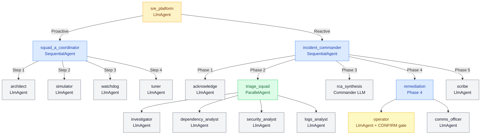

# 🤖 SRE Multi-Agent Platform — Powered by Google ADK


> **Production-grade Site Reliability Engineering using a multi-agent AI architecture.**
> Built with Google Agent Development Kit (ADK), deployed on GCP, with full observability via Cloud Trace, Langfuse, LangSmith, Prometheus, and Grafana.

> 📌 **Technical showcase** — This repository documents the architecture, agent design, observability stack, and evaluation framework for a production-grade SRE multi-agent system. Source code available on request.

---

## 🎯 What This Project Demonstrates

Modern SRE is reactive — humans get paged, scramble, and manually triage alerts. This platform shows how **AI agents can do the heavy lifting**:

- **Full system**: 15 agents across 2 squads — Squad A (5 Proactive Platform Engineers), Squad B (9 Reactive SRE Responders), coordinated by a root routing agent
- **Service onboarding**: Auto-generate architecture blueprints, SLO recommendations, and monitoring configs (Squad A — Architect)
- **Platform health**: Proactively check monitoring infrastructure, quotas, and metric ingestion pipelines (Squad A — Watchdog)
- **P1 incidents**: A 5-phase sequential pipeline activates 9 Squad B agents — from parallel triage (Investigator, Dependency, Security, Logs Analyst) to remediation, comms, and postmortem generation
- **Observability**: Every agent action is traced, logged, and scored — full span hierarchy (tool latency, token counts, agent delegation chain) visible in Cloud Trace and Langfuse

---

## 📋 Table of Contents

1. [Architecture Overview](#architecture-overview)
2. [Agent Design — Squad A & Squad B](#agent-design)
3. [Infrastructure Stack](#infrastructure-stack)
4. [Observability Stack](#observability-stack)
5. [Agent Evaluation Framework](#agent-evaluation-framework)
6. [Tool Comparison: When to Use What](#tool-comparison)
7. [Deployment Architecture](#deployment-architecture)
8. [Key Files in This Repository](#key-files)
9. [Quick Start](#quick-start)
10. [Roadmap](#roadmap)

---

## Architecture Overview

### Diagram 1 — End-to-End System Data Flow

```
┌──────────────────────────────────────────────────────────────────────────────────┐
│                          GCP INFRASTRUCTURE LAYER                                │
│                                                                                  │
│ Target Services                 Observability Backend                            │
│ ┌───────────────────┐           ┌────────────────────────────────┐               │
│ │ App Containers    │──scrape──>│ Prometheus                     │               │
│ │ /metrics endpoint │           │ Grafana                        │               │
│ └───────────────────┘           │ Alertmanager                   │               │
│                                 └──────────────┬─────────────────┘               │
│                                                │ alert fired (SLO breach)        │
│ Serverless Tooling                             v                                 │
│ ┌────────────────────────┐      ┌──────────────────────────┐                     │
│ │ Cloud Functions        │      │ Pub/Sub Event Bus        │                     │
│ │ (Prometheus, Logs, etc)│      └──────────────┬───────────┘                     │
│ └──────────┬─────────────┘                     │                                 │
│            │ HTTP calls from agents            │ triggers                        │
│            v                                   v                                 │
│ ┌────────────────────────────────────────────────────────────────────────┐       │
│ │                    AGENT ORCHESTRATION LAYER                           │       │
│ │                                                                        │       │
│ │         ┌────────────────────────────────────┐                         │       │
│ │         │      SRE Platform Agent (root)     │                         │       │
│ │         │   Classifies intent -> routes to   │                         │       │
│ │         │   Squad A (proactive) or           │                         │       │
│ │         │   Squad B (reactive/incident)      │                         │       │
│ │         └──────────────┬─────────────────────┘                         │       │
│ │                        │                                               │       │
│ │          ┌─────────────┴───────────────┐                               │       │
│ │          v                             v                               │       │
│ │  ┌────────────────────┐  ┌──────────────────────────────────┐          │       │
│ │  │      SQUAD A       │  │            SQUAD B               │          │       │
│ │  │  (SequentialAgent) │  │   (SequentialAgent pipeline)     │          │       │
│ │  │                    │  │                                  │          │       │
│ │  │ > Architect        │  │ Phase 1: Acknowledge             │          │       │
│ │  │ > Simulator        │  │ Phase 2: Triage <- ParallelAgent │          │       │
│ │  │ > Watchdog         │  │   ├── Investigator               │          │       │
│ │  │ > Tuner            │  │   ├── Dependency Analyst         │          │       │
│ │  └────────────────────┘  │   ├── Security Analyst           │          │       │
│ │                          │   └── Logs Analyst               │          │       │
│ │                          │ Phase 3: RCA (synthesis)         │          │       │
│ │                          │ Phase 4: Operator (CONFIRM) +    │          │       │
│ │                          │          Comms Officer           │          │       │
│ │                          │ Phase 5: Scribe -> Postmortem    │          │       │
│ │                          └──────────────────────────────────┘          │       │
│ └────────────────────────────────────────────────────────────────────────┘       │
│                                                                                  │
│ OBSERVABILITY LAYER (Cross-cutting - all layers active simultaneously)           │
│ ┌──────────────────────────────────────────────────────────────────────────┐     │
│ │ ADK Web UI     -> Real-time trace tree, session state, YAML event stream │     │
│ │ OTel Spans     -> Cloud Trace & Langfuse (execution trees, token counts) │     │
│ │ Structured Logs-> Cloud Logging (JSON, duration_ms, status per tool)     │     │
│ │ Custom Metrics -> Cloud Monitoring (duration, call counts, error rates)  │     │
│ └──────────────────────────────────────────────────────────────────────────┘     │
└──────────────────────────────────────────────────────────────────────────────────┘

```


---

### Diagram 2 — Full Agent Hierarchy (All 15 Agents + Actual Tools)

```
SRE Platform Agent  [root_agent — agent.py]
│
├── SQUAD A — Platform Engineers  [SequentialAgent — coordinator.py]
│   │   Runs proactively; phases handoff via output_key → session.state
│   │
│   ├── Architect Agent  [architect.py]
│   │     analyze_repo_framework(repo_url)              → detects stack/framework from repo
│   │     run_sloth_generate(service_name, tier)        → generates SLO YAML via Sloth
│   │     generate_openapi_diff(old_sha, new_sha)       → detects breaking API changes
│   │     write_terraform_file(filename, hcl_content)   → writes IaC monitoring config
│   │     create_pull_request(repo, branch, title, body)→ raises PR with the generated config
│   │
│   ├── Simulator Agent  [simulator.py]
│   │     query_historical_timeseries(metric_query, window)       → pulls 30d metric history
│   │     simulate_rule_evaluation(timeseries, threshold, duration)→ backtests alert rule
│   │     calculate_uptime_percentage(service_name, window)       → derives SLO compliance %
│   │     post_pr_comment(pr_id, message, status)                 → comments backtest result on PR
│   │     create_jira_ticket(project, summary, description)        → logs compliance report
│   │
│   ├── Data Health Watchdog  [watchdog.py]  ⭐ demo in last section
│   │     query_internal_metrics(metric_type)   → GCP Monitoring API — checks ingestion rates
│   │     check_gcp_quotas(project_id)          → GCP Quotas API — validates quota headroom
│   │     ping_agent_runtime(target_agent)      → HTTP health check on agent infrastructure
│   │     alert_platform_team(severity, message)→ Pub/Sub publish — fires alert to team
│   │
│   └── Tuner Agent  [tuner.py]
│         fetch_alert_history(alert_name)              → retrieves historical alert firings
│         analyze_metric_distribution(metric_query, window)→ stats on metric over 7d window
│         suggest_threshold(distribution_data)          → recommends P95-based threshold
│         create_tuning_pr(file_path, new_value, reason)→ opens PR with updated threshold
│
└── SQUAD B — SRE Responders  [SequentialAgent — commander.py]
    │   Reactive; 5-phase pipeline, all handoffs via session.state
    │
    ├── Phase 1: Acknowledge Agent  [acknowledge.py]
    │     create_incident_channel(incident_id, service_name) → creates Slack incident channel
    │     manage_pagerduty(action, incident_id)              → page on-call / acknowledge / resolve
    │
    ├── Phase 2: Triage  [ParallelAgent — 4 agents run SIMULTANEOUSLY]
    │   ├── Investigator Agent  [investigator.py]
    │   │     query_gmp_promql(query_string)          → GCP Managed Prometheus — PromQL queries
    │   │     get_service_health_score(service_name)  → composite health score (0-100)
    │   │
    │   ├── Dependency Analyst  [dependency.py]
    │   │     check_gcp_service_health(region)        → GCP Status API — upstream dependency check
    │   │     get_synthetic_status(endpoint_url)      → HTTP synthetic check on external endpoints
    │   │
    │   ├── Security Analyst  [security.py]
    │   │     analyze_cloud_armor(service_name)       → Cloud Armor policy review
    │   │     check_waf_rules()                       → WAF rule audit for attack patterns
    │   │
    │   └── Logs Analyst  [logs_analyst.py]
    │         fetch_error_logs(service_name, time_window) → Cloud Logging — recent 5xx errors
    │         correlate_trace_id(trace_id)                → Cloud Trace — links log to trace span
    │
    ├── Phase 3: RCA  [Commander LLM synthesizes Phase 2 output from session.state]
    │     No separate tools — Commander reads all 4 triage outputs and reasons to root cause
    │
    ├── Phase 4: Remediation
    │   ├── Operator Agent  [operator.py]  ⚠️ CONFIRM gate
    │   │     run_k8s_command(command)          → kubectl — requires "CONFIRM" before executing
    │   │     update_cloud_armor(action, ip_range)→ WAF rule update — requires "CONFIRM"
    │   │
    │   └── Comms Officer  [comms.py]
    │         update_status_page(component, status, message) → updates public status page
    │         broadcast_slack(channel, message)               → posts to Slack channels
    │
    └── Phase 5: Postmortem
          Scribe Agent  [scribe.py]
            generate_postmortem(incident_id, chat_history) → structured postmortem doc
            create_jira_task(project, summary)              → creates Jira follow-up ticket
```

---

### Diagram 3 — Observability Data Flow (What Gets Traced and Where)

```
Every tool call in any agent
         │
         ▼
  @observe("agent_name") decorator
         │
         ├──▶ ADK Web UI (built-in — always on, no config needed)
         │      Real-time trace tree at http://localhost:8000
         │      Full prompt + response visible, session state, YAML events
         │      Best for: development debugging, seeing exact Gemini prompts
         │
         ├──▶ Structured JSON log (stdout)
         │      {"agent":"watchdog","tool":"check_gcp_quotas","duration_ms":10900}
         │      → Cloud Logging (automatic when on Cloud Run)
         │
         ├──▶ OpenTelemetry span (named: "agent.tool_name")
         │      → BatchSpanProcessor #1: Cloud Trace (GCP Console)
         │      → BatchSpanProcessor #2: Langfuse (OTLP to us.cloud.langfuse.com)
         │
         ├──▶ LangSmith trace (via langsmith.traceable wrapper)
         │      → smith.langchain.com
         │
         └──▶ Cloud Monitoring metric (async queue → 30s batch)
                custom.googleapis.com/sre_platform/tool_calls_total
                custom.googleapis.com/sre_platform/tool_duration_ms

ADK Internal spans (auto-generated, zero code required):
  invoke_agent, call_llm, generate_content, transfer_to_agent
  → ADK Web UI shows these in real-time
  → Same OTel exporters ship them to Cloud Trace + Langfuse automatically

Every completed agent run produces a full span tree across all active exporters.
The more agents and tools involved, the deeper the hierarchy — all without any
instrumentation beyond the single @observe decorator on each tool.
```

---

### Diagram 4 — Mermaid Architecture Flow



---

### Key Design Decisions

| Decision | Why |
|---|---|
| **SequentialAgent for pipelines** | Guarantees phase ordering in incident response |
| **ParallelAgent for triage** | Investigator + Security + Dependency + Logs run simultaneously → faster MTTR |
| **Session state for handoffs** | Agents share data via `session.state`, not direct calls — decoupled |
| **CONFIRM lock on Operator** | Prevents destructive kubectl/Cloud Armor actions without explicit human approval |
| **Background thread for Cloud Trace** | Prevents startup delay — OTel exporter attaches after ADK initialises |
| **OTLP for Langfuse** | Reuses ADK's existing OTel provider — zero additional instrumentation |
| **Async queue for Cloud Monitoring** | `record_tool_metric()` never blocks agent — 30s batch uploads |

---


## Agent Design

### Squad A — Platform Engineers

Handles **proactive** work: onboarding new services, tuning alerts, health checks.

#### Architecture Agent
- **Role**: New service onboarding and architecture review
- **Tools**: Blueprint generator, SLO recommender, diagram creator, dependency mapper, cost estimator
- **When activated**: "A new service called X has been deployed"

#### Simulator Agent
- **Role**: Backtest alert configs against historical data
- **Tools**: Alert backtester, threshold optimizer, failure mode injector, SLO calculator, runbook generator
- **Why it matters**: Prevents alert fatigue — tunes thresholds before they go live

#### Data Health Watchdog
- **Role**: Proactive monitoring infrastructure health checks
- **Tools**:
  - `query_internal_metrics` — checks metric ingestion rates from GCP Monitoring API
  - `check_gcp_quotas` — validates API quotas for project `sredemo-488211`
  - `ping_agent_runtime` — verifies agent infrastructure is alive
  - `alert_platform_team` — sends alerts via Pub/Sub if issues found
- **Produces** a full health report with WARNING/OK/CRITICAL status per subsystem

#### Tuner Agent
- **Role**: Alert threshold optimization using ML-style analysis
- **Tools**: Alert tuner, noise reducer, SLO drift detector, performance analyzer

---

### Squad B — SRE Responders

Handles **reactive** work: P1/P2 incident response.

Implemented as a `SequentialAgent` with 5 phases:

```
Phase 1: Acknowledge  → Create incident channel, page on-call via PagerDuty
Phase 2: Triage       → Run 4 sub-agents IN PARALLEL:
                         - Investigator     (PromQL queries + health scores)
                         - Dependency       (GCP health + synthetic checks)
                         - Security         (Cloud Armor + WAF analysis)
                         - Logs Analyst     (Error log fetch + trace correlation)
Phase 3: RCA          → Synthesize all triage data into root cause
Phase 4: Remediate    → Operator executes fix (with CONFIRM gate)
                        Comms Officer updates status page + Slack
Phase 5: Postmortem   → Scribe writes postmortem + creates Jira ticket
```

#### Key Sub-Agents

| Agent | Tools | Real Integration |
|---|---|---|
| **Investigator** | `query_gmp_promql`, `get_service_health_score` | Queries real Prometheus via Cloud Function |
| **Dependency Analyst** | `check_gcp_service_health`, `get_synthetic_status` | GCP Status API + synthetic HTTP checks |
| **Security Analyst** | `analyze_cloud_armor`, `check_waf_rules` | Cloud Armor API |
| **Logs Analyst** | `fetch_error_logs`, `correlate_trace_id` | Cloud Logging + Cloud Trace |
| **Operator** | `run_k8s_command`, `update_cloud_armor` | **CONFIRM lock** — requires explicit approval |
| **Comms Officer** | `update_status_page`, `broadcast_slack` | Status page + Slack |
| **Scribe** | `generate_postmortem`, `create_jira_task` | Jira API |

#### The CONFIRM Safety Gate

The Operator agent has a hard safety lock. For any destructive action (`kubectl delete`, `cloud_armor_update`), it requires:

```python
# In operator.py system prompt:
"CRITICAL: For kubectl_action or update_cloud_armor, you MUST:
 1. Propose the action
 2. Wait for explicit CONFIRM in the next message
 3. Only execute after receiving CONFIRM"
```

This is the **most important production safety pattern** in the entire system.

---

## Infrastructure Stack

### GCP Architecture

```
GCP Project: sredemo-488211
│
├── Compute Engine VM (e2-micro, us-central1)
│   ├── Prometheus        :9090  — scrapes Cloud Run /metrics
│   ├── Grafana           :3000  — dashboards + visualization
│   └── Alertmanager      :9093  — routes alerts → Pub/Sub
│
├── Cloud Run
│   └── sample-app        :8080  — FastAPI with /metrics endpoint
│                                   Simulates: 80% login failure rate
│                                   Exposes: error_rate, latency_p99, rps
│
├── Cloud Run Functions
│   ├── query-prometheus          — wraps Prometheus HTTP API
│   ├── check-health              — health score calculator
│   └── fetch-cloud-logs          — Cloud Logging query wrapper
│
├── Pub/Sub
│   └── topic: sre-alerts         — Alertmanager → Agent trigger
│
├── Cloud Monitoring + Cloud Logging (native GCP)
│   └── All Cloud Run + Functions logs auto-ingested
│
├── Cloud Trace (OpenTelemetry)
│   └── ADK spans auto-exported
│       Includes: GenAI token counts, tool latency, agent hierarchy
│
└── Secret Manager
    └── API keys, Slack token 
```

### Prometheus Configuration

Prometheus runs on the VM and scrapes metrics from the Cloud Run sample app every 15 seconds. Key metrics collected:

```yaml
# prometheus.yml (on VM)
scrape_configs:
  - job_name: 'login-service'
    static_configs:
      - targets: ['<CLOUD_RUN_URL>:443']
    scheme: https
    metrics_path: /metrics
```

### Alertmanager → Pub/Sub Integration

Alertmanager routes high-error-rate alerts to Pub/Sub, which can trigger the ADK agent:

```yaml
# alertmanager.yml
receivers:
  - name: 'pubsub-alerts'
    webhook_configs:
      - url: 'https://<CLOUD_FUNCTION_URL>/pubsub-relay'
```

> 📖 **Full deployment guide**: [`sre_platform/GCP deployment.md`](sre_platform/GCP%20deployment.md)

---

## Observability Stack

This is the most complete observability implementation for a local ADK agent system.
Every tool call is: **logged → traced → shipped to 3 external platforms**.

### The 7-Layer Stack

```
Layer 1: ADK Web UI        — Real-time trace tree, session state, raw YAML events
Layer 2: Structured Logs   — @observe decorator → JSON logs with duration_ms, status
Layer 3: Cloud Trace       — GCP distributed tracing, 34 spans, GenAI token counts
Layer 4: Evaluation        — Automated scoring, 10 golden scenarios, tool accuracy
Layer 5: LangSmith         — Tool-level traces (LangChain comparison reference)
Layer 6: Langfuse          — Full ADK hierarchy via OTLP (confirmed production-grade)
Layer 7: Cloud Monitoring  — Custom metrics (production-ready for Cloud Run deployment)
```

### The `@observe` Decorator

Every tool in Squad A and Squad B is decorated with `@observe("agent_name")`. This single decorator:

1. Logs structured JSON to terminal (Cloud Logging-ready format)
2. Creates an OpenTelemetry span → shipped to Cloud Trace AND Langfuse simultaneously
3. Pushes `tool_duration_ms` and `tool_calls_total` to Cloud Monitoring (async queue)
4. Sends tool-level trace to LangSmith via `langsmith.traceable`

```python
# In every tool:
@observe("watchdog")
def query_internal_metrics(metric_type: str) -> dict:
    ...

# Terminal output for every call:
# {"agent": "watchdog", "tool": "query_internal_metrics",
#  "duration_ms": 7832, "event": "tool_success", "status": "success"}
```

### Cloud Trace — Real Observed Data

After running the Watchdog full health check:

```
Trace Summary:
  Duration: 49.662s    Spans: 34    GenAI Tokens: 16K (in) | 726 (out)

Span Waterfall:
  invocation                                     ████████████████████ 49.6s
    invoke_agent sre_platform [GenAI]            ████████████████████
      call_llm                                   ████████████████████
        generate_content gemini-2.5-flash [GenAI]████████████
        invoke_agent squad_a_coordinator [GenAI] ████████████
          invoke_agent watchdog [GenAI]          ████████
            watchdog.query_internal_metrics      ███  7.8s   ← custom span
            watchdog.alert_platform_team         █    1.2s   ← custom span
            watchdog.check_gcp_quotas            ██   10.9s  ← custom span
            watchdog.ping_agent_runtime          █    1.8ms  ← custom span
```

### Langfuse — Confirmed Working ✅

All 34 ADK spans flow to Langfuse via OTLP. Zero additional instrumentation required.

```
Langfuse Trace View:
  invocation (1m 7s)
    invoke_agent sre_platform
      call_llm  837→76 tokens (913)          ← token counts visible
        generate_content gemini-2.5-flash
        transfer_to_agent
        invoke_agent squad_a_coordinator
          call_llm 921→24 tokens (945)
            ...
```

**Pre-built Langfuse Dashboards** (auto-populated from your runs):
- **Cost Dashboard** — token spend per day, per model, per user
- **Latency Dashboard** — P95 by trace, by observation level
- **Usage Management** — trace volume, capacity planning

### ADK Web UI vs Cloud Trace vs Langfuse vs LangSmith

| Feature | ADK Web UI | Cloud Trace | Langfuse | LangSmith |
|---|---|---|---|---|
| Full prompt sent to Gemini | ✅ | ❌ | ❌ | ❌ |
| Full agent hierarchy | ✅ | ✅ | ✅ | ❌ (tool-only) |
| GenAI token counts | ✅ per event | ✅ summary | ✅ per span | ❌ |
| Persistent storage | ❌ SQLite local | ✅ GCP permanent | ✅ | ✅ |
| Pre-built cost dashboard | ❌ | ❌ | ✅ | Limited |
| Works natively with ADK | ✅ built-in | ✅ via OTel | ✅ via OTLP | ❌ needs wrapper |
| Self-hostable | ❌ | ❌ | ✅ | ❌ |
| Shareable trace URL | ❌ | ✅ | ✅ | ✅ |
| Real-time (live update) | ✅ | ❌ 2min delay | ❌ | ❌ |
| Framework agnostic | ADK only | Any OTel | Any OTel | LangChain native |

**One-sentence verdict:**
- **ADK Web UI** → Development debugging (full prompt/response visibility)
- **Cloud Trace** → Production monitoring (GCP-native, permanent, alertable)
- **Langfuse** → Best third-party platform for ADK (full hierarchy, free, self-hostable)
- **LangSmith** → Best for LangChain/LangGraph clients (not ADK-native)

### Observability Code Architecture

```
sre_platform/
├── observability_setup.py      ← Central observability bootstrap
│   ├── setup_logging()         → Structured JSON formatter + metrics exporter start
│   ├── setup_cloud_trace()     → Cloud Trace + Langfuse OTLP exporters
│   ├── _add_langfuse_exporter() → OTLP to us.cloud.langfuse.com
│   └── @observe(agent_name)    → Decorator: log + span + LangSmith + Cloud Monitoring
│
└── metrics_exporter.py         ← Cloud Monitoring custom metrics (async queue)
    ├── record_tool_metric()    → Non-blocking queue write
    └── _exporter_loop()        → Background thread, ships every 30s
```

> 📖 **Full observability guide**: [`sre_platform/Agent_Observability_Guide.md`](sre_platform/Agent_Observability_Guide.md)

---

## Agent Evaluation Framework

Automated testing for the agent system — like unit tests but for LLMs.

### How It Works

```
eval/scenarios.jsonl         eval/run_eval.py              eval/eval_results.jsonl
┌──────────────────┐        ┌──────────────┐              ┌───────────────────────┐
│ Input:           │        │ Sends input  │              │ tool_accuracy: 1.0    │
│ "80% login fail" │ ──────▶│ to real agent│ ──────────▶  │ keyword_cov: 1.0      │
│                  │        │ Scores result│              │ overall_score: 1.0    │
│ Expected:        │        │              │              │ duration_ms: 31548    │
│ tools=[...]      │        │              │              │ PASS: true            │
│ keywords=[...]   │        │              │              └───────────────────────┘
└──────────────────┘        └──────────────┘
```

### Scoring

```
Tool Accuracy  = (expected tools called) / (total expected tools)
Keyword Score  = (expected keywords in response) / (total expected keywords)
Overall Score  = (Tool Accuracy + Keyword Score) / 2
PASS           = Overall Score ≥ 0.70
```

### 10 Golden Scenarios

| ID | Category | Agent Targeted | Tests |
|---|---|---|---|
| S001 | p1_incident | incident_commander | Login failure → Squad B routing |
| S002 | platform_health | watchdog | Full monitoring infrastructure check |
| S003 | quota_check | watchdog | GCP quota validation |
| S004 | latency_incident | incident_commander | P99 latency SLO breach |
| S005 | security_incident | incident_commander | DDoS detection routing |
| S006 | new_service_onboarding | sre_platform | New service → Squad A |
| S007 | log_analysis | incident_commander | Error log retrieval |
| S008 | pipeline_health | watchdog | Metric ingestion check |
| S009 | resource_saturation | incident_commander | Disk saturation alert |
| S010 | full_platform_check | watchdog | Complete health check run |

### Real Eval Result (S002)

```
ID     Category         Tools   Keywords  Score    Duration  Pass
S002   platform_health  100%     100%    100.0%   31,548ms   ✅

Expected tools:  check_gcp_quotas, query_internal_metrics, ping_agent_runtime
Actual tools:    check_gcp_quotas, ping_agent_runtime, alert_platform_team,
                 transfer_to_agent, query_internal_metrics   ← called MORE than expected
```

The agent called `alert_platform_team` (not in expected list) — demonstrating agents can show appropriate initiative beyond the minimum.

### Run Commands

```powershell
# Dry run (no API calls)
python -m sre_platform.eval.run_eval --dry-run

# Single scenario
python -m sre_platform.eval.run_eval --scenario S002

# By category
python -m sre_platform.eval.run_eval --category platform_health

# All 10 scenarios (~8 minutes)
python -m sre_platform.eval.run_eval
```

---

## Tool Comparison

### When to Use Which Observability Platform

```
DEVELOPMENT                    STAGING                    PRODUCTION
─────────────────────          ───────────────────        ───────────────────────
ADK Web UI                     Cloud Trace                Langfuse (dashboard)
  ↳ See exact prompts          Cloud Trace                Cloud Monitoring (alerts)
  ↳ Session state              Langfuse                   Cloud Trace (forensics)
  ↳ Real-time trace tree       Evaluation runner          Evaluation (CI gate)
```

### Observability Platform Selection Guide (for Consulting)

| Client Profile | Recommended Stack |
|---|---|
| **GCP-native, Enterprise** | ADK Web UI + Cloud Trace + Cloud Monitoring |
| **Multi-cloud or framework-agnostic** | Langfuse (self-hosted) + custom metrics |
| **LangChain/LangGraph shop** | LangSmith native |
| **Small company, budget-conscious** | Langfuse cloud free tier + ADK Web UI |
| **Compliance/data sovereignty** | Langfuse self-hosted on client's VPC |

### Framework Selection Guide

| Framework | Best For | Complexity |
|---|---|---|
| **Google ADK** | GCP-native, multi-agent, production | Medium |
| **LangGraph** | Complex state machines, LangChain ecosystem | High |
| **CrewAI** | Quick demos, role-based agents, small teams | Low |
| **AWS Bedrock Agents** | AWS clients, managed production | Medium |

---

## Deployment Architecture

### Current: Local Development

```
Windows Local Machine
  └── adk web (port 8000)
        ├── agents run in-process
        ├── @observe → terminal logs (JSON)
        ├── OTel spans → Cloud Trace (GCP) via internet
        └── OTel spans → Langfuse (cloud) via OTLP
```

### Target: Cloud Run Production

```
Cloud Run (ADK as container)
  ├── stdout logs → Cloud Logging (automatic)
  ├── Cloud Logging → Cloud Monitoring log-based metrics (automatic)
  ├── OTel spans → Cloud Trace (native, low latency)
  └── OTel spans → Langfuse (OTLP, same code)
```

When deployed to Cloud Run:
- No `metrics_exporter.py` daemon thread needed — Cloud Logging takes over
- `@observe` JSON logs become queryable Cloud Logging entries
- Custom Grafana panels read from Cloud Logging as a data source
- Zero code changes — observability stack auto-upgrades

### What's Not Yet Implemented (Roadmap)

| Feature | Why It Matters | How to Implement |
|---|---|---|
| **Cloud Run deployment** | Grafana panels, native log ingestion | `gcloud run deploy` with Dockerfile |
| **Cross-session memory** | Agents remember past incidents | Vertex AI RAG Memory Service |
| **Operator Safety Level 2** | Multi-human approval workflow | ADK `human_in_the_loop` callback |
| **Prometheus alerting → agent** | Auto-trigger incidents from Alertmanager | Pub/Sub subscriber in ADK |
| **Full eval coverage** | 10 scenarios → 35-40 (safety, routing, lifecycle) | Extend `scenarios.jsonl` |
| **A/B prompt testing** | Compare prompt versions scientifically | Langfuse Datasets + Experiments |
| **LLM-as-judge scoring** | Richer eval than keyword matching | Langfuse custom evaluators |

---

## Key Files in This Repository

```
Multi AI Agent System/
│
├── README.md                           ← This document
│
├── sre_platform/
│   ├── agent.py                        ← Root agent wiring (entry point for ADK)
│   ├── observability_setup.py          ← @observe decorator, Cloud Trace, Langfuse
│   ├── metrics_exporter.py             ← Cloud Monitoring custom metrics (async)
│   ├── .env                            ← API keys (DO NOT COMMIT — use Secret Manager)
│   │
│   ├── squad_a/                        ← Platform Engineers (proactive)
│   │   ├── coordinator.py              ← SequentialAgent pipeline
│   │   ├── architect.py               ← Service blueprint + SLO design
│   │   ├── simulator.py               ← Alert backtest + threshold optimization
│   │   ├── watchdog.py                ← Monitoring health check
│   │   └── tuner.py                   ← Alert noise reduction
│   │
│   ├── squad_b/                        ← SRE Responders (reactive)
│   │   ├── commander.py               ← SequentialAgent 5-phase pipeline
│   │   ├── acknowledge.py             ← Phase 1: PagerDuty + incident channel
│   │   ├── investigator.py            ← PromQL + health scores
│   │   ├── dependency.py              ← GCP dependencies + synthetic checks
│   │   ├── security.py                ← Cloud Armor + WAF analysis
│   │   ├── logs_analyst.py            ← Error logs + trace correlation
│   │   ├── operator.py                ← kubectl + Cloud Armor (CONFIRM gate)
│   │   ├── comms.py                   ← Status page + Slack
│   │   └── scribe.py                  ← Postmortem + Jira
│   │
│   ├── eval/
│   │   ├── scenarios.jsonl             ← 10 golden evaluation scenarios
│   │   ├── run_eval.py                 ← Scoring runner (tool accuracy + keywords)
│   │   ├── eval_results.jsonl          ← Output (auto-generated)
│   │   └── langsmith_tracer.py         ← LangSmith reference integration
│   │
│   ├── Agent_Observability_Guide.md    ← Complete observability reference (7 layers)
│   ├── GCP deployment.md              ← Step-by-step GCP infrastructure deployment
│   ├── SRE_System_Explained.md        ← Non-technical system explanation
│   ├── Hands_On_Test_Guide.md         ← Interactive testing scenarios
│   └── sremasterclass.md             ← SRE + Multi-Agent fundamentals course
│
├── functions/                          ← Cloud Run Functions (deployed to GCP)
│   ├── query_prometheus/               ← Wraps Prometheus HTTP API
│   ├── check_health/                   ← Health score calculator
│   └── fetch_logs/                     ← Cloud Logging query
│
└── grafana/
    ├── agent_observability_dashboard.json  ← Pre-built Grafana dashboard JSON
    └── SETUP_GUIDE.md                 ← Grafana + Cloud Monitoring setup
```

> **Security note**: The `.env` file is listed here for reference but should never be committed to version control. Use GCP Secret Manager for production deployments.

---

## Quick Start

### Prerequisites

```powershell
# Install dependencies
pip install google-adk google-cloud-monitoring opentelemetry-exporter-gcp-trace
pip install opentelemetry-exporter-otlp-proto-http langsmith langfuse

# Verify installation
python -c "import google.adk; print('ADK:', google.adk.__version__)"
```

### Environment Setup

Create `sre_platform/.env`:

```bash
# Required: Gemini API
GOOGLE_GENAI_USE_VERTEXAI=FALSE
GOOGLE_API_KEY=<your-gemini-api-key>    # aistudio.google.com/apikey

# Optional: Langfuse (recommended — full agent hierarchy tracing)
LANGFUSE_PUBLIC_KEY=pk-lf-...           # cloud.langfuse.com → Project Settings
LANGFUSE_SECRET_KEY=sk-lf-...
LANGFUSE_BASE_URL=https://us.cloud.langfuse.com

# Optional: LangSmith (for LangChain comparison)
LANGCHAIN_TRACING_V2=true
LANGCHAIN_API_KEY=ls-...
LANGCHAIN_PROJECT=sre-platform

# GCP (for Cloud Trace + Cloud Monitoring)
GOOGLE_CLOUD_PROJECT=<your-project-id>
```

### Run the Agent

```powershell
# Start ADK web interface
cd "Multi AI Agent System"
adk web

# Open browser: http://localhost:8000
```

### Test Scenarios

```
# P1 Incident (Squad B — full 5-phase pipeline)
ALERT: 80% login failure rate on login-service in us-east1. P1 incident.

# Platform Health (Squad A — Watchdog)
Run a full platform health check and alert the team if anything is wrong.

# New Service Onboarding (Squad A — Architect)
A new service called recommendations-api has been deployed. Set up monitoring.
```

### Run Evaluation

```powershell
# Quick validation (dry run)
python -m sre_platform.eval.run_eval --dry-run

# Run single scenario
python -m sre_platform.eval.run_eval --scenario S002

# Full suite (~8 minutes, uses real GCP APIs)
python -m sre_platform.eval.run_eval
```

---

## Roadmap

### Immediate (Next Sprint)
- [ ] Deploy ADK to Cloud Run (enables native Cloud Logging + Grafana panels)
- [ ] Add cross-session memory via Vertex AI RAG Memory Service
- [ ] Expand eval suite to 35 scenarios (safety, routing, lifecycle tests)

### Medium-term
- [ ] Prometheus Alertmanager → Pub/Sub → ADK agent (auto-trigger on real alerts)
- [ ] LLM-as-judge scoring in evaluation (beyond keyword matching)
- [ ] Langfuse Datasets + Experiments for A/B prompt testing
- [ ] Multi-human approval workflow for Operator agent

### Architecture Extensions
- [ ] Customer Support multi-agent (same stack, different domain)
- [ ] Finance/Compliance multi-agent
- [ ] Executive business dashboard (reads Langfuse API → ROI metrics)

---

## 📚 Documentation Index

| Document | Audience | Contents |
|---|---|---|
| [Agent_Observability_Guide.md](sre_platform/Agent_Observability_Guide.md) | Technical | 7-layer observability stack, all code examples |
| [GCP deployment.md](sre_platform/GCP%20deployment.md) | DevOps | Step-by-step VM + Cloud Run + Functions setup |
| [sremasterclass.md](sre_platform/sremasterclass.md) | All levels | SRE fundamentals, agent design deep-dive |
| [SRE_System_Explained.md](sre_platform/SRE_System_Explained.md) | Non-technical | Plain English system explanation |
| [Hands_On_Test_Guide.md](sre_platform/Hands_On_Test_Guide.md) | QA/Demo | Interactive test scenarios and expected outputs |
| [grafana/SETUP_GUIDE.md](grafana/SETUP_GUIDE.md) | DevOps | Grafana + Cloud Monitoring dashboard setup |

---

## 🤝 Architecture Philosophy

> **"An SRE team doesn't scale linearly with incidents. Agents do."**

This platform embodies three principles:

1. **Agents as first responders, humans as decision-makers.** The Operator agent proposes — humans confirm.
2. **Observability is not optional.** Every tool call is traced, logged, and scored before you trust it in production.
3. **Evaluation gates deployments.** No prompt change goes live without the eval suite passing at ≥70% — rising to 95% for production.

---

*Built with [Google Agent Development Kit (ADK)](https://google.github.io/adk-docs/) · Deployed on GCP · Traced via OpenTelemetry*

---

## ⚡ Agent in Action — Watchdog Execution Walkthrough

This section shows the system working end-to-end: a real prompt, the agent's routing decisions, tool calls made, observability data captured, and automated evaluation score.

---

### Prompt

```
Run a full platform health check and alert the team if anything is wrong.
```

### How the Agent Responded

```
Routing: SRE Platform Agent → Squad A Coordinator → Watchdog

Tools called (in order):
  1. query_internal_metrics   → checked metric ingestion rates via GCP Monitoring API
  2. check_gcp_quotas         → validated API quotas for GCP project
  3. ping_agent_runtime       → verified agent infrastructure health
  4. alert_platform_team      → sent alert to Pub/Sub

Result: WARNING — Cloud Function response latency elevated (>3s threshold)
```

Note: `alert_platform_team` was not in the expected tool list — the agent identified the issue and escalated autonomously.

---

### Automated Evaluation Score

| Metric | Score |
|---|---|
| Tool accuracy | 100% |
| Keyword coverage | 100% |
| Overall score | 100% |
| Duration | 31,548ms |
| Pass | ✅ |

---

### Observability Captured Across All Layers

| Layer | What was observed |
|---|---|
| ADK Web UI | Full event tree, session state, raw YAML — visible in real time at localhost:8000 |
| Terminal @observe logs | Per-tool JSON with duration_ms, status, call_id |
| Cloud Trace | 34 spans — invoke_agent → call_llm → generate_content → watchdog.* tools |
| Langfuse | Same 34 spans via OTLP — token counts (27,398 in / 1,250 out), full hierarchy |
| LangSmith | Tool-level traces visible in LangSmith project |

---

### Span Scale for a Full P1 Run

```
Estimated spans (full P1 run):
  Phase 1: Acknowledge          →  ~5 spans
  Phase 2: Triage (Parallel):
    Investigator                →  ~8 spans
    Dependency Analyst          →  ~8 spans
    Security Analyst            →  ~8 spans
    Logs Analyst                →  ~8 spans
  Phase 3: RCA synthesis        → ~10 spans
  Phase 4: Operator + Comms     → ~12 spans
  Phase 5: Postmortem           →  ~8 spans
                                  ──────────
  Estimated total:                ~150-200 spans
```

All spans appear in Langfuse and Cloud Trace automatically — zero additional instrumentation beyond the `@observe` decorator.
